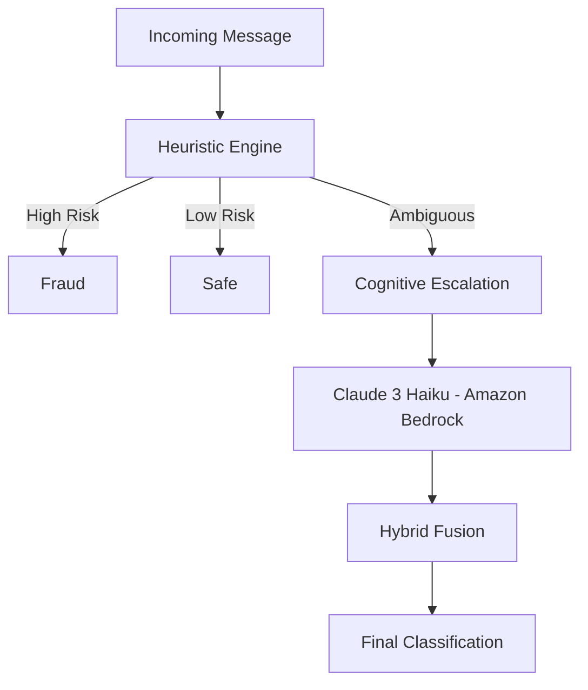

# guardinia
Serverless cloud project focused on scam detection, security practices and AWS architecture.

# GuardinIA 🛡️

Serverless hybrid fraud detection engine built on AWS, combining deterministic heuristics and cognitive AI (Amazon Bedrock).

---

## 📌 Overview

GuardinIA is a hybrid anti-fraud engine designed to detect digital scams using:

- Deterministic rule-based heuristics
- Psychological pressure analysis
- Financial anomaly detection
- Context-aware semantic signals
- Cognitive escalation using Claude 3 Haiku (Amazon Bedrock)

The system is designed to reduce cost by escalating only ambiguous cases to AI.

---

## 🧠 Logical Architecture

---

## ⚙️ Technical Stack

- AWS Lambda
- Amazon Bedrock (Claude 3 Haiku)
- Amazon DynamoDB
- Amazon Textract
- API Gateway
- WhatsApp Cloud API
- Python 3.11

---

## 🔬 Offline Benchmark (Heuristics Only)

Dataset size: 2000 messages  
- 800 labeled as scam  
- 1200 labeled as legitimate  

Results:

- Accuracy: 90.45%
- Precision (Scam): 100%
- Recall (Scam): 80.90%
- F1 Score: 89.44%
- Average latency: 0.33ms

---

## 🤖 AI Recovery Test (Hybrid Escalation)

Controlled test on ambiguous false negatives.

Sample size: 50  
- Recovery Rate: 100%  
- Average model latency: 2.12s  
- Average cost per call: $0.000253  
- Total estimated cost: $0.012630  

---

## 🎯 Design Philosophy

- Cost-aware AI usage
- Heuristic-first architecture
- Controlled cognitive escalation
- Defensive cloud architecture
- LGPD-safe logging strategy

---

## 🚀 Status

Project completed as production-ready prototype.

Designed for portfolio demonstration of:
- Cloud architecture
- Hybrid AI systems
- Security engineering
- Performance benchmarking

---

## 📄 License

MIT
