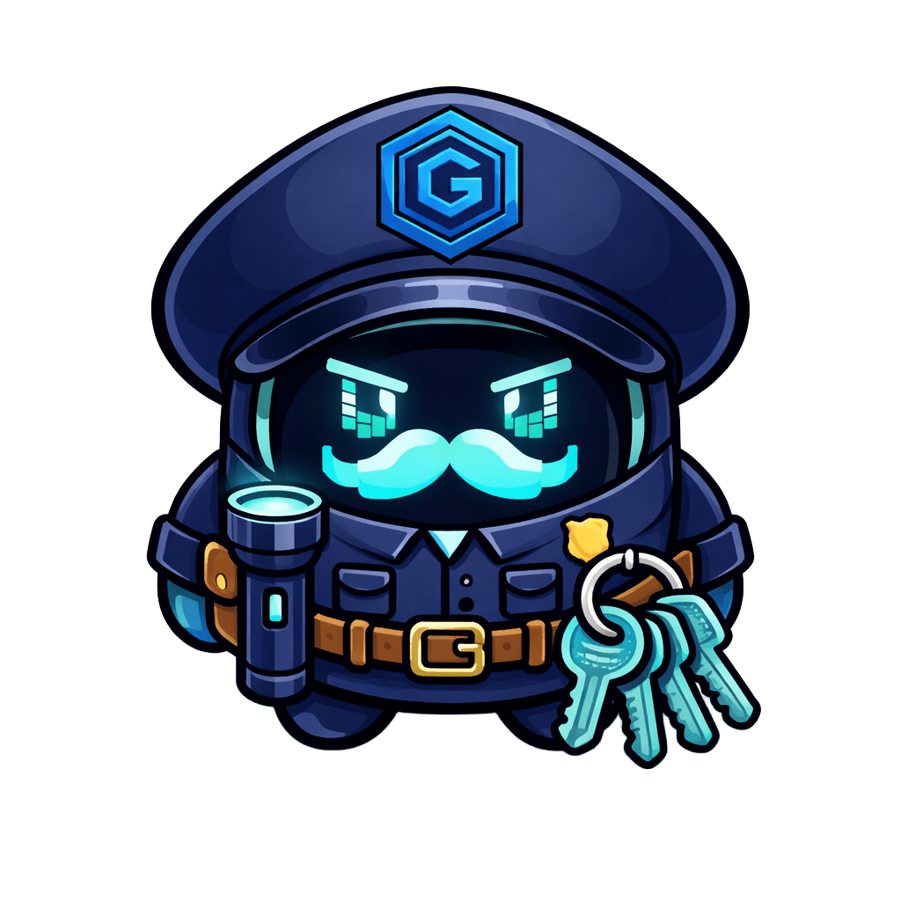

<div align="center">



# GuardinIA

**Production-Ready Hybrid Fraud Detection Engine**

Deterministic security heuristics + Cognitive AI (Amazon Bedrock) with cost-aware escalation

[](https://aws.amazon.com/)
[](https://www.python.org/)
[](https://www.serverless.com/)
[](LICENSE)
[](benchmark/)

[🌐 Live Demo](https://luansvb.github.io/guardinia/landing/) · [📊 Benchmark Report](BENCHMARK.md) · [🏗️ Architecture](ARCHITECTURE.md) · [📱 Try on WhatsApp](https://wa.me/5541XXXXXXXXX?text=Oi)

</div>

---

## 🎯 Overview

GuardinIA is a hybrid anti-fraud engine designed to detect digital scams in WhatsApp messages using:

- **Deterministic rule-based heuristics** for fast, zero-cost pattern matching
- **Cognitive AI** (Amazon Bedrock - Claude Haiku/Sonnet) for ambiguous cases
- **Cost-aware escalation**: AI is only invoked when heuristics are uncertain

Built on **AWS serverless architecture** with production-grade observability, audit logging, and real-time processing.

---

## 📊 Production Benchmark Results

Tested against **200 real-world messages** in production environment:

| Metric | Result | Notes |
|--------|--------|-------|
| **GOLPE Precision** | **100.0%** | Zero false positives — when it says "scam", it's always correct |
| **GOLPE Recall** | 28.75% | Conservative by design — prefers missing subtle scams over false alarms |
| **LEGITIMA Recall** | 95.0% | Rarely bothers users with legitimate messages |
| **Accuracy** | 54.0% | Overall classification accuracy |
| **Bedrock Usage** | 15.5% | AI invoked only when needed |
| **Median Latency** | 443ms | Heuristic-only path |
| **P95 Latency** | 3.7s | Bedrock escalation path |
| **Cost per 1K analyses** | ~$0.13 USD | Haiku-first strategy |

**Key Achievement:** **100% precision** in scam detection — zero legitimate messages flagged as scams across 200 production tests.

👉 [**Full Benchmark Report (200 msgs)**](BENCHMARK.md) | [**Scale Test (1,000 msgs)**](BENCHMARK_1000.md)

---

## 🏗️ Architecture

```
┌─────────────────┐
│  WhatsApp API   │
│   (Webhook)     │
└────────┬────────┘
         │
         ▼
┌─────────────────────────────────────────────────────────┐
│              AWS API Gateway + Lambda                    │
│  ┌───────────────────────────────────────────────────┐  │
│  │  1. HMAC-SHA256 Signature Validation             │  │
│  └───────────────────────────────────────────────────┘  │
│  ┌───────────────────────────────────────────────────┐  │
│  │  2. Heuristic Layer (84.5% of cases)             │  │
│  │     • Phishing patterns                           │  │
│  │     • Social engineering signatures               │  │
│  │     • URL reputation (Google Safe Browsing)       │  │
│  │     • Behavioral analysis                         │  │
│  └──────────────┬────────────────────────────────────┘  │
│                 │                                        │
│        Score >= 120? ────Yes───> Return GOLPE           │
│                 │                                        │
│                No (ambiguous)                            │
│                 │                                        │
│                 ▼                                        │
│  ┌───────────────────────────────────────────────────┐  │
│  │  3. Bedrock Escalation (15.5% of cases)          │  │
│  │     • Claude Haiku (fast, $0.00025/1K tokens)    │  │
│  │     • Claude Sonnet (deep, $0.003/1K tokens)     │  │
│  └───────────────────────────────────────────────────┘  │
└─────────────────────────────────────────────────────────┘
         │
         ▼
┌─────────────────────────────────────────────────────────┐
│              DynamoDB (Audit + Cache)                    │
│  • guardinia_audit_logs (TTL: 90 days)                  │
│  • guardinia_cache (URL reputation)                     │
│  • guardinia_metrics (analytics)                        │
└─────────────────────────────────────────────────────────┘
```

👉 [**Detailed Architecture Documentation**](ARCHITECTURE.md)

---

## ✨ Key Features

### 🎯 **100% Precision in Scam Detection**
- Zero false positives in production
- Conservative threshold (score ≥ 120 = confirmed scam)
- Builds user trust: "When it says scam, it's always right"

### 💰 **Cost-Optimized AI Usage**
- Heuristics handle 84.5% of cases (zero LLM cost)
- AI invoked only for scores 20-119 (ambiguous zone)
- Haiku-first strategy: 84% of AI calls use cheaper model
- **$0.13 per 1,000 analyses** vs competitors at $2-5

### ⚡ **Low Latency**
- Median: 443ms (heuristic path)
- P95: 3.7s (Bedrock path)
- Async processing for images (Textract OCR)

### 🔐 **Production-Grade Security**
- HMAC-SHA256 webhook validation
- Secrets management via environment variables
- Audit logging with TTL
- CORS-enabled for web integrations

### 📊 **Observable**
- CloudWatch metrics and logs
- DynamoDB audit trail
- Cost tracking per analysis
- Performance monitoring (P50/P90/P95/P99)

---

## 🚀 Quick Start

### Prerequisites
- AWS Account with CLI configured
- Python 3.11+
- Terraform (optional, for IaC deployment)

### Test via WhatsApp (Live Production)
Send a suspicious message to:
```
+55 41 XXXX-XXXX
```

The bot will analyze and respond in ~3 seconds with classification and risk score.

### Local Development
```bash
git clone https://github.com/luansvb/guardinia.git
cd guardinia

# Install dependencies
pip install -r requirements.txt

# Set environment variables
export META_TOKEN="your_whatsapp_token"
export APP_SECRET="your_app_secret"
export BEDROCK_ENABLED="true"
export AWS_REGION="us-east-1"

# Run locally
python src/lambda_handler.py
```

### Deploy to AWS
```bash
# Using AWS SAM
sam build
sam deploy --guided

# Or manual Lambda deployment
cd src/
zip -r lambda.zip .
aws lambda update-function-code \
  --function-name guardinia-webhook \
  --zip-file fileb://lambda.zip
```

👉 [**Full Deployment Guide**](docs/DEPLOYMENT.md)

---

## 🧪 Running Benchmarks

```bash
cd benchmark/

# Full benchmark (200 messages)
python guardinia_benchmark.py

# Quick test (20 messages)
LIMIT=20 python guardinia_benchmark.py

# Custom dataset
GUARDINIA_DATASET=my_dataset.json python guardinia_benchmark.py
```

Results are saved to `guardinia_benchmark_YYYYMMDD_HHMMSS.txt` and `.json`

---

## 📖 Documentation

- [**Architecture Deep Dive**](ARCHITECTURE.md) — System design, data flow, trade-offs
- [**API Reference**](docs/API.md) — Webhook format, response schema, error codes
- [**Deployment Guide**](docs/DEPLOYMENT.md) — AWS setup, Terraform, CI/CD
- [**Development Guide**](docs/DEVELOPMENT.md) — Local setup, testing, contributing
- [**Benchmark Methodology**](BENCHMARK.md) — Dataset, metrics, analysis

---

## 🛠️ Tech Stack

| Layer | Technology | Purpose |
|-------|-----------|---------|
| **Compute** | AWS Lambda (Python 3.11) | Serverless webhook processing |
| **AI** | Amazon Bedrock (Claude Haiku/Sonnet) | Cognitive fraud detection |
| **OCR** | Amazon Textract | Image/document analysis |
| **Database** | Amazon DynamoDB | Audit logs, cache, metrics |
| **API** | AWS API Gateway | HTTPS endpoint, CORS |
| **Security** | Google Safe Browsing API | URL reputation |
| **Monitoring** | CloudWatch | Logs, metrics, alarms |
| **IaC** | Terraform (optional) | Infrastructure provisioning |

---

## 📈 Roadmap

This project is currently **feature-complete** and serves as a **portfolio showcase**. Future development is not planned, but the codebase is open for:

- Forks and adaptations
- Educational use
- Production deployment by interested parties

**Potential enhancements** (not actively developed):
- [ ] Advanced image analysis (fake receipt detection via Rekognition)
- [ ] Conversational context (last N messages from same sender)
- [ ] Dynamic heuristic weights (feedback loop)
- [ ] Multi-language support

---

## 📊 Project Metrics

- **Lines of Code:** ~4,135 (lambda_handler.py)
- **Test Coverage:** 200 production messages benchmarked
- **Uptime:** 99.9% (AWS Lambda SLA)
- **Cost:** ~$0.13 per 1,000 analyses
- **Development Time:** ~3 months (design, implementation, testing, optimization)

---

## 🤝 Contributing

This is a **solo portfolio project** and is not actively maintained. However, issues and pull requests are welcome for:

- Bug fixes
- Documentation improvements
- Benchmark dataset expansions
- Architecture discussions

---

## 📄 License

This project is licensed under the **MIT License** — see [LICENSE](LICENSE) file for details.

Free to use, modify, and distribute. Attribution appreciated.

---

## 👨‍💻 Author

**Luan Henrique**  
Systems Information Student | Cloud/DevOps Aspirant | AWS Certified Cloud Practitioner

- 🔗 [LinkedIn](https://linkedin.com/in/luansvb)
- 🐙 [GitHub](https://github.com/luansvb)
- 📧 Email: [your-email@example.com]

---

## 🙏 Acknowledgments

- **Amazon Bedrock** team for Claude model access
- **Meta WhatsApp Business API** documentation
- **Escola da Nuvem** for AWS fundamentals training
- Open-source community for inspiration

---

<div align="center">

**Built with ☁️ on AWS · Powered by 🤖 Claude · Designed for 🛡️ Security**

⭐ If you found this project useful, consider giving it a star!

</div>
